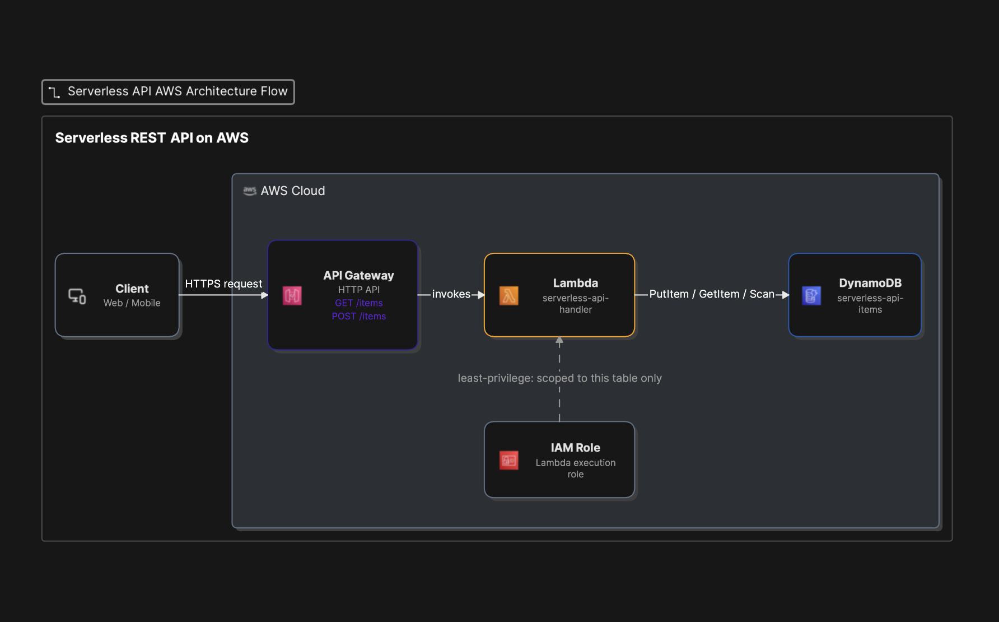
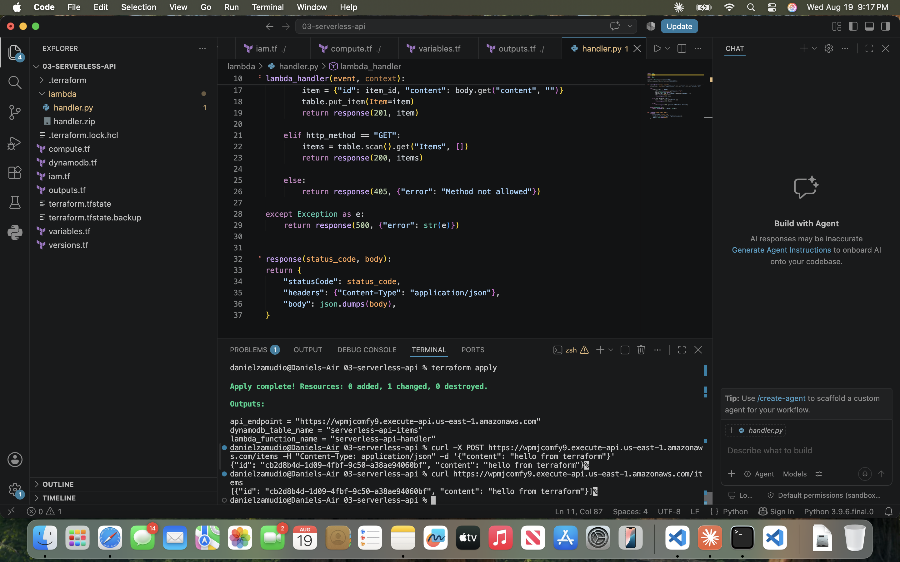
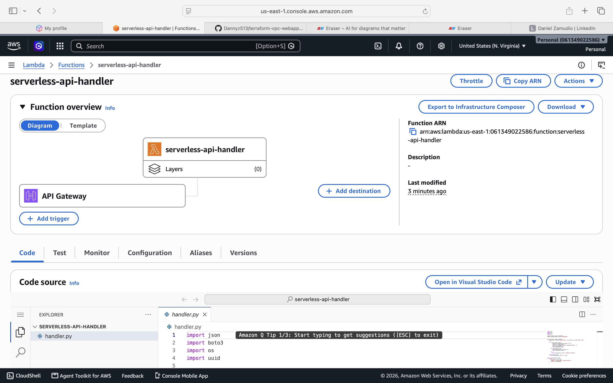
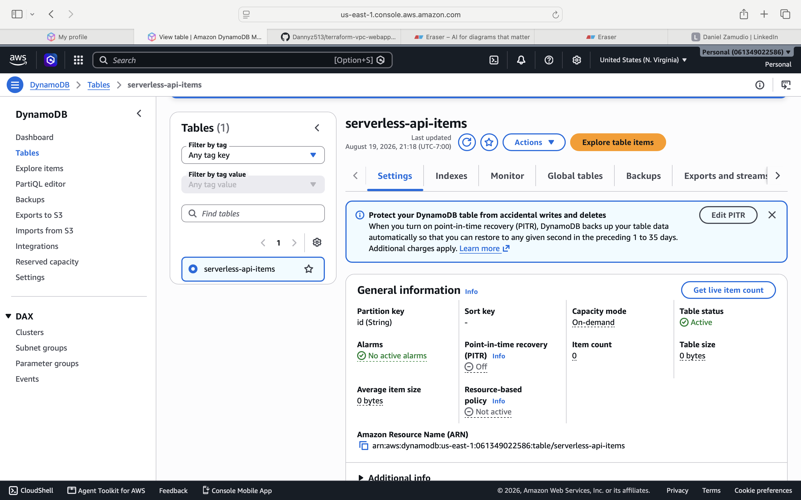
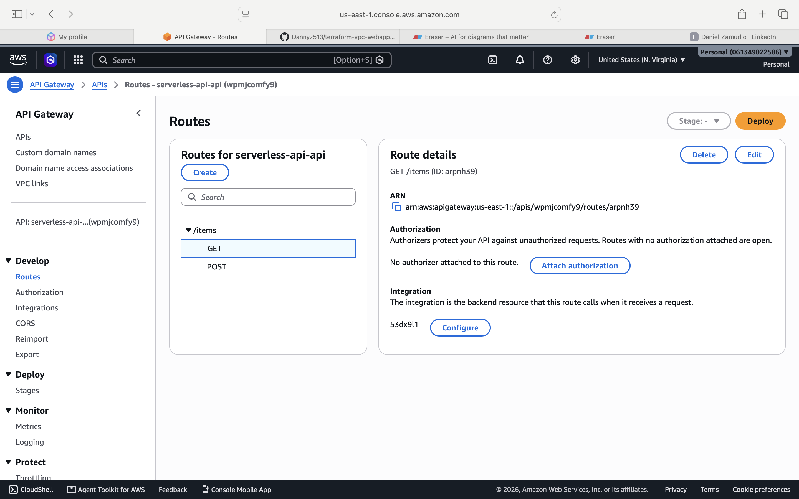

# 🚀 Serverless CRUD API — Lambda + API Gateway + DynamoDB

A fully serverless REST API built with Terraform, using AWS Lambda, API Gateway, and DynamoDB. Demonstrates least-privilege IAM design and a real-world debugging scenario with API Gateway's HTTP API payload format.


## Overview

## Architecture



This project provisions a complete serverless backend: an HTTP API Gateway routes `GET`/`POST` requests to a Python Lambda function, which reads and writes items to a DynamoDB table. No servers to manage, pay-per-request billing, and infrastructure defined entirely in Terraform.

## What This Demonstrates

- Serverless architecture: API Gateway (HTTP API) → Lambda → DynamoDB
- **Least-privilege IAM**: the Lambda's execution role only grants the exact DynamoDB actions needed (`PutItem`, `GetItem`, `Scan`, `Query`) scoped to a single table ARN — not `AdministratorAccess` or wildcard resources
- Automated Lambda packaging via Terraform's `archive_file` data source (no manual zipping)
- Environment variables passed from Terraform into Lambda at deploy time
- Real debugging: API Gateway's HTTP API (`payload_format_version = "2.0"`) nests the HTTP method differently than the older REST API format — this project's code was fixed to correctly read `event["requestContext"]["http"]["method"]` instead of the older `event["httpMethod"]`

## Testing It

**Create an item:**
```bash
curl -X POST https://your-api-url/items \
  -H "Content-Type: application/json" \
  -d '{"content": "hello from terraform"}'
```

**Retrieve all items:**
```bash
curl https://your-api-url/items
```



**Lambda function, deployed via Terraform:**


**Item stored in DynamoDB:**


**API Gateway routes:**


## Usage

```bash
terraform init
terraform plan
terraform apply
```

Grab the `api_endpoint` output and test with the curl commands above.

Tear down when finished:
```bash
terraform destroy
```

## Cost

DynamoDB uses `PAY_PER_REQUEST` billing (only pay for actual reads/writes — no idle cost). Lambda and API Gateway are both effectively free at this scale under AWS's free tier. This is one of the cheapest architectures to leave running for testing.

## Tech Stack

- **Terraform** 1.15
- **AWS**: Lambda, API Gateway (HTTP API), DynamoDB, IAM
- **Python** 3.12